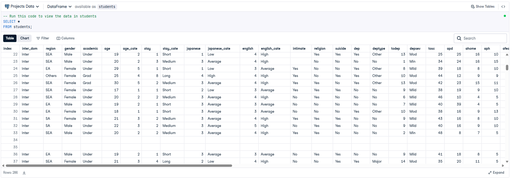
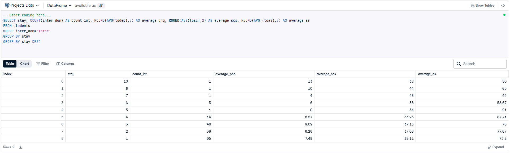

# 🎓 Analyzing Students' Mental Health (SQL Project)

## 📌 Project Overview
In this project, I analyzed a dataset from a Japanese international university to understand how the **length of stay** impacts the **mental health** of international students. The study focused on depression (PHQ-9), social connectedness (SCS), and acculturative stress (ASISS).

This project was completed as part of a DataCamp certification.

## 📌 Project Goal:
To analyze whether the length of stay in a foreign country impacts the mental health of international students. The study focused on depression (PHQ-9), social connectedness (SCS), and acculturative stress (ASISS).

## 📂 Files in this Repository
* `notebook.ipynb`: The SQL code containing the analysis
* `result_image.png`: A snapshot of the query results
* `Students.csv` : Raw data source
* `mentalhealth.jpg`: Cover picture of the project

## Description of the columns of "students.csv" you may find helpful:

| Field Name    | Description                                      |
| ------------- | ------------------------------------------------ |
| `inter_dom`     | Types of students (international or domestic)   |
| `japanese_cate` | Japanese language proficiency                    |
| `english_cate`  | English language proficiency                     |
| `academic`      | Current academic level (undergraduate or graduate) |
| `age`           | Current age of student                           |
| `stay`          | Current length of stay in years                  |
| `todep`         | Total score of depression (PHQ-9 test)           |
| `tosc`          | Total score of social connectedness (SCS test)   |
| `toas`          | Total score of acculturative stress (ASISS test) |


## 🛠️ Tools & Skills
* **Language:** SQL (PostgreSQL)
* **Techniques:** Data Filtering (`WHERE`), Aggregation (`AVG`, `COUNT`), Grouping (`GROUP BY`), Ordering (`ORDER BY`), Data rounding (`ROUND`).

## 📊 Query "all" results in students table


## 📊 Key Findings
After filtering for international students (`inter_dom = 'Inter'`) and grouping by the length of stay, the analysis revealed:

1.  **Depression Score (PHQ-9):** The average depression score varies depending on how long the student has been in the country.
2.  **Stress Levels (ASISS):** Acculturative stress shows distinct patterns across different lengths of stay.

### The Main Query
The following SQL query was used to aggregate the data:

```sql
SELECT stay, 
       COUNT(inter_dom) as count_int,
       ROUND(AVG(todep), 2) as average_phq, 
       ROUND(AVG(tosc), 2) as average_scs, 
       ROUND(AVG(toas), 2) as average_as
FROM students
WHERE inter_dom = 'Inter'
GROUP BY stay
ORDER BY stay DESC;
```


## 📈 Results
The analysis reveals how mental health metrics fluctuate for international students depending on their duration of stay. The SQL query returned the following aggregated data:




## Conclusions
Confirmed that international students face higher risks of mental health difficulties linked to social connectedness.

## Crucial Insight
Upon analyzing the "stay", I identified a sample size issue with durations exceeding 5 years.
I concluded that only the 1-4 year range provides statistically significant data, as the low sample count for other durations would distort the correlation analysis regarding depression scores.